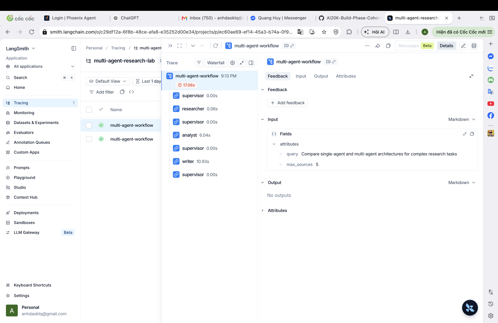
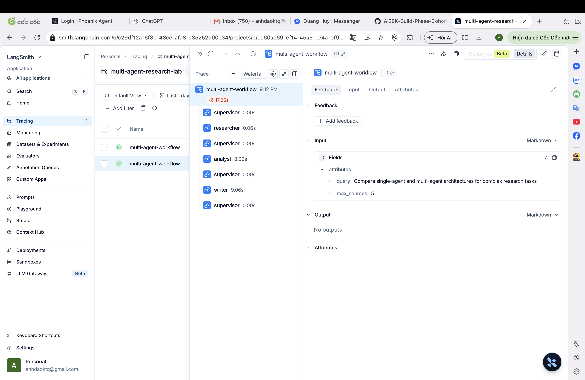

# Trace Evidence

## Run command

```bash
LANGSMITH_TRACING=true \
.venv/bin/python -m multi_agent_research_lab.cli multi-agent \
  -q "Compare single-agent and multi-agent architectures for complex research tasks"
```

## Observed route history

```text
researcher -> analyst -> writer -> done
```

## Trace explanation

| Step | Event | Detail |
|---:|---|---|
| 1 | `supervisor.route` | Inspected shared state: no sources, no analysis, no final answer → routed to `researcher`. |
| 2 | `researcher.complete` | Retrieved 5 offline corpus sources (A04, A06, T01-SYN-A, T01-SYN-B, T01-SYN-C), wrote cited research notes. |
| 3 | `supervisor.route` | Sources present, analysis missing → routed to `analyst`. |
| 4 | `analyst.complete` | Called OpenAI gpt-4o-mini (381 output tokens), converted research notes into grounded insights with citations. |
| 5 | `supervisor.route` | Sources + analysis present, final answer missing → routed to `writer`. |
| 6 | `writer.complete` | Called OpenAI gpt-4o-mini (526 output tokens), produced the final answer with source-ID citations. |
| 7 | `supervisor.route` | All artifacts present → routed to `done`. |
| 8 | `workflow.complete` | Ended with `error_count=0`, `has_final_answer=true`, total duration ~17.5 s. |

## LangSmith tracing

Traces are sent to the LangSmith project **multi-agent-research-lab** via the
`langsmith` SDK (v0.11.1). Each supervisor/worker span is recorded as a separate
LangSmith run of type `chain`, with attributes, tags, and duration metadata.

The project can be viewed at: <https://smith.langchain.com/>  
(Navigate to project **multi-agent-research-lab** after logging in with the
account that owns the API key.)

## Screenshots

### Run 1 (9:12 PM) — multi-agent-workflow, 17.25s



### Run 2 (9:13 PM) — multi-agent-workflow, 17.06s


